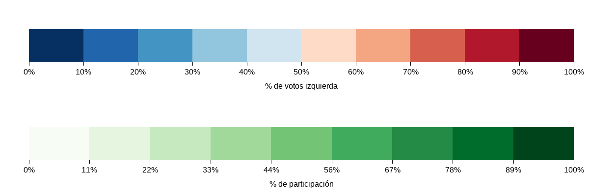
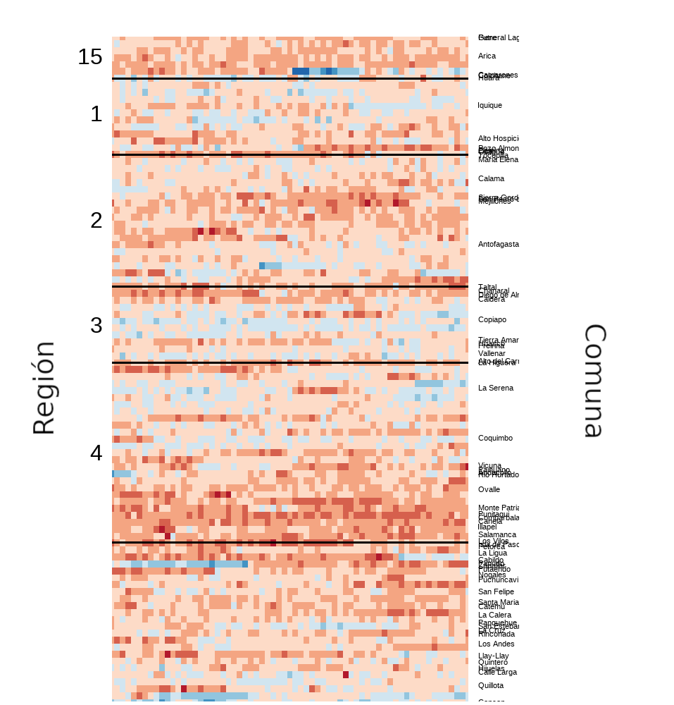

# Introducción

En este apartado veremos que cosas podemos encontrar en el sitio, como interpretar esta información y una breve explicación metodológica.


## Motivación

Durante el último tiempo, hemos observado un creciente interés por conversar y debatir sobre los cambios y eventos que ha experimentado la participación electoral en Chile. Los cambios en la participación, la nuevas agrupaciones y conglomerados que establecen nuevos escenarios electorales y la composición y posible predicción de los electores se han vuelto temas de alta relevancia a nivel nacional, por lo que es relevante encontrar mecanismos para poder conocer mejor su funcionamiento.

En este contexto, nos hemos propuesto presentar información a través de la presentación de nuevas formas de análisis y de diversas formas de visualización, con el fin de aportar y mejorar la discusión y debate en torno a estos temas. Todo esto, para contribuir con alternativas que puedan fomentar el desarrollo de propuestas y otras formas de discusión del fenómeno electoral.

A través de la manipulación de datos y evidencia se entregará información que pueda ser interpretada de manera sencilla que fomente la discusión basada en evidencia empírica.
Para lograr este objetivo hemos establecido dos aspectos que consideramos relevantes:

Por un lado, la utilización de **metodología basada en evidencia**, estableciendo rigurosidad en la elaboración de información. Por lo que nuestros análisis estarán enfocados en la interpretación considerando los posibles beneficios y problemas que pueden generarse a través de la decisión de técnicas y mecanismos de interpretación de datos.

Por otro lado, para la elaboración de un adecuada evaluación e interpretación de datos, creemos que es necesario poder establecer **transparencia** del proceso con el fin de favorecer la comprensión del desarrollo y procedimiento que lleva a cada una de estas conclusiones. Esto, gracias a la presentación de los resultados en conjunto con la información acerca del proceso de análisis, las referencias utilizadas y explicaciones del proceso.

## Objetivos

En esta ocasión, nuestro objetivo es contrastar la participación electoral de los votantes en cada conglomerado político. Las elecciones primarias del año 2017 y 2021 se han presentado como un escenario ideal para comparar la participación electoral en torno a dos ofertas electorales similares (pese a que ambos han sufrido importantes cambios durante el último tiempo).

Si bien no es posible obtener inferencias o explicaciones causales que podrían explicar la preferencia de los votantes, la visualización de los cambios de tendencias pueden presentar una oportunidad única de discusión sobre los escenarios políticos que está enfrentando el país y la evaluación de aspectos contextuales que pueden afectar el desarrollo de cada uno de estos procesos.

## Metodología

Para poder contrastar la participación electoral y evaluar las posibles diferencias en las preferencias electorales, lo primero que obtuvimos fue la información electoral de todos los comicios aquí estudiados, desde la página oficial del servicio electoral. Una vez obtenidos, tuvimos que enfrentar y definir los siguientes escenarios.


### Definición de *Izquierda* y *Derecha*

Con el fin de poder distinguir si existe alguna fluctuación en las tendencias políticas de los votantes, nuestro primer desafío consistió en la elaboración de un criterio que permitiese separar las preferencias políticas de los votantes a partir de sus sufragios. Para esto utilizaremos como supuesto que el voto implicará una preferencia por una opción política. Esto no necesariamente implicará que sea una tendencia permanente, sino al contrario, es la opción que una persona optó dado el contexto electoral de ese momento.

Considerando lo anterior, estableceremos las preferencias del Frente Amplio y Apruebo Dignidad agrupadas bajo la categoría “izquierda” mientras que las opciones de Chile Vamos y Chile Podemos Más como “derecha.” Esta decisión no se encuentra exenta de problemas, ya que algunas alternativas pueden ser catalogadas fuera de esta dicotomía. Sin embargo, es una aproximación que nos permite tener una mirada un poco más general y sencilla de la realidad nacional.

¿Debemos ser tan *Blanco y Negro*? Por el momento sí, ya que facilita los análisis.

¿Cuál es el beneficio de utilizar una diferencia tan arbitraria? Al ser una categorización sencilla, nos permite poder mantenerla de manera consistente en el tiempo. De la misma forma, esta separación nos permite establecer en grandes rasgos diferencias en las preferencias de votación, permitiendo identificar si un sector electoral mantiene su tendencia histórica o el escenario político implicó una mayor participación en otra dirección.

Es importante clarificar que esta clasificación tiene un interés investigativo, por lo que en esta ocasión no consideraremos otros aspectos relevantes relacionadas a las diferencias políticas dentro de los conglomerados.

En algunos casos un cierto tipo de votación no puede ser asignado a izquierda ni derecha. Tal es el caso de los independientes fuera de pacto, o el caso del ex candidato presidencial Franco Parisi. Los votos blancos y nulos tampoco serán considerados (al no poder asignados a alguna tendencia).


### El problema de la consistencia de cada mesa y su agrupamiento

Una vez establecida las clasificaciones de los votos, nuestro siguiente elemento a considerar es la comparación entre una o varias elecciones. Qué más quisiera un analista que tener cada mesa de manera individualizada, ubicada en el mismo lugar y ver en el tiempo como varían, pero no es tan fácil. Dependiendo de las elecciones, las mesas se agrupan y una mesa “física”, puede estar compuesta de varias mesas “*teóricas*”. Por ejemplo, para una elección en particular, la mesa M31 puede estar compuesta de las mesas M31, M32 y M41. En la siguiente elección puede estar cada mesa individualizada, o agrupadas con otras mesas, por lo que no es posible llegar y comparar directamente.

Las razones para fusionar o dividir que hay detrás de la agrupación de mesas del SERVEL la desconocemos, por lo que tampoco es posible conocer con anterioridad si estos criterios se mantendrán o cambiarán en una futura elección. Junto a lo anterior, hay que considerar que también se agregan nuevas mesas al sistema, las que cuando se comparan en el tiempo, no presentan una referencia anterior.

El escenario descrito anteriormente, nos plantea un desafío interesante ya que esta situación nos conllevará a tener que establecer una clasificación de mesas que nos permita establecer un escenario común en ambos tiempos. Para poder resolver este escenario hemos definido una agrupación de mesas como **Mesa Estacionaria (ME)** las cuáles consisten en una agrupación de mesas que está compuesta por todas aquellas que son comunes en los periodos estudiados (una especie de mínimo común divisor), particularmente entre el año 2017 y 2021.

|Mesa 2017|Mesa 2021| ME|
|:--:|:--:|:--:|
|1-2|1|-|
|-|-|1-2-3-4|
|3|2-3-4|-|
|4|-|-|

A modo de ejemplo, tal cómo se presenta en la tabla anterior tenemos un esquema de agrupación hipotética de las mesas del año 2017 y el año 2021. Como es posible ver en el año 2017 las mesas 1-2 fueron fusionadas, mientras que en el año 2021 la mesa 1 se mantuvo separada y la mesa 2 fue fusionada con la mesa 3 y 4. En este sentido, no es posible establecer ninguna comparación de manera aislada de la mesa 1 ya que en un año se mantuvo de manera independiente, pero en otro año esta se mantuvo unida a otra mesa por lo que sus resultados no son posibles de separar. Por la misma razón la **Mesa Estacionaria** conformada por las mesas 1, 2, 3 y 4 permitirá hacer una comparación contemplando todas las mesas y sus relaciones de forma de poder comparar un similar número de electores en ambos eventos.


### Indicadores

Ninguno de los siguientes indicadores considera los votos que no hayan sido clasificados previamente como izquierda/derecha.

#### Porcentaje de votación de izquierda ($\%I_t$) {#metodos-porcentaje-izq-der}

El indicador principal que se calcula es el del porcentaje de votos de izquierda por sobre el total (votos de izquierda + votos de derecha), en una votación o periodo $t$.

$$
\%I_t = \frac{I_t} {I_t + D_t}
$$
con,

  - $I_t$ = Nº de votos de izquierda en la ME, en el tiempo/elección $t$.
  - $D_t$ = Nº de votos de derecha en la ME, en el tiempo/elección $t$.
  
Este indicador varía entre 0 y 1 (0 y 100%), y muestra si la población votó izquierda o derecha. Un valor inferior a 0.5 (50%) indica que dicha ME votó mayoritariamente derecha, mientas que un valor superior al 50% indicaría que votó mayoritariamente izquierda. 


#### Tasa de cambio o pendiente ($TC$)

Este indicador muestra la relación entre entre el cambio en el eje vertical (el eje izquierdo del espector político) y horizontal (el eje derecho del espectro político), entre dos elecciones diferentes ($t$ y $t+1$).

$$
TC = \frac{I_{t + 1} - I_{t} } {D_{t + 1} - D_{t} }
$$
con,

  - $I_{t}$ = Nº de votos de izquierda en la ME, en el tiempo/elección $t$ (por ejemplo, los votos en la primaria presidencial del 2017).
  - $I_{t + 1}$ = Nº de votos de izquierda en la ME, en el tiempo/elección $t + 1$ (por ejemplo, los votos en la primaria presidencial del 2021).
  - $D_{t}$ = Nº de votos de derecha en la ME, en el tiempo/elección $t$ (por ejemplo, los votos en la primaria presidencial del 2017).
  - $D_{t + 1}$ = Nº de votos de derecha en la ME, en el tiempo/elección $t + 1$ (por ejemplo, los votos en la primaria presidencial del 2021).
  
Este indicador varía entre $-\infty$ y $\infty$ y su interpretación no es tan sencilla, razón por la cuál se desglosa en los siguientes dos indicadores para facilitar la interpretabilidad.
  

#### Magnitud del cambio ($M$)

Este indicador muestra el número de votos en términos absolutos en que se movió la ME. Visto de otra forma, la distancia euclidiana entre dos elecciones diferentes ($t$ y $t+1$).

$$
M = \sqrt{(I_{t + 1} - I_{t})^2 + (D_{t + 1} - D_{t})^2 }
$$

Su resultado varía entre $0$ y $\infty$ e indica que tantos votos se movió la ME entre elecciones.


#### Dirección del cambio ($\alpha$)

El indicador anterior muestra la magnitud del cambio y este indicador $\alpha$ señala la dirección del cambio. Es decir, si se movió hacía la derecha, la izquierda, aumentaron ambos o dimisniuyeron ambos.

$$
\alpha = tan(TC)^{-1}
$$

Su resultado varía entre $0$ y $360$ grados y denota la dirección del cambio.

- $0º$ a $90º$: corresponde al cuadrante $--$, izquierda y derecha perdieron votos. Se representará en tonos de color morado.
- $90º$ a $180º$: corresponde al cuadrante $-+$, izquierda pierde votos y la derecha gana votos. Se representará en tonos de color azul.
- $180º$ a $270º$: corresponde al cuadrante $++$, izquierda y derecha ganaron votos. Se representará en tonos de color verde.
- $270º$ a $360º$: corresponde al cuadrante $+-$, izquierda gana votos y la derecha pierde votos. Se representará en tonos de color rojo.

Teniendo $M$ y $\alpha$ se puede saber hacia y donde y en que grado/magnitud se movió una determinada ME.

## Gráficas

Para poder presentar la información obtenida de manera más sencilla, hemos generado una serie de visualizaciones.

A partir de la recodificación de conglomerados descrita anteriormente, hemos clasificado en dos alternativas de participación (Eje Izquierda-Derecha) el comportamiento de cada mesa, adquiriendo un color azul en caso de obtener una mayor proporción de votos de la coalición de derecha y un color rojo en el caso de la proporción de votos de la coalición de izquierda.

A continuación, presentaremos diversos gráficos que permitirán mostrar los cambios referidos.


### Dispersograma

Con este gráfico hemos buscado retratar la tendencia de las fluctuaciones que han tenido las Mesas Estacionarias entre un proceso y otro, por medio de una nube de puntos. Cada punto que se observa en el gráfico corresponde a una Mesa Estacionaria y su ubicación indica su situación en relación a la votación anterior.

### ADN {#ADN}

A través de este gráfico se visualiza de manera general cada una de las Mesas Estacionarias que se encuentran en las distintas comunas del país. Estos gráficos apilados de manera horizontal reflejan de manera similar a una secuencia de ADN, la distribución y proporción de participación en cada una de las Mesas Estacionarias creadas anteriormente. Se definió la forma de presentación alargada para asemejar la forma geográfica de Chile continental.

Cada cuadrado o píxel representa una de estas mesas - que a su vez se encuentran conformadas por las mesas fusionadas en cada elección -, en donde se le asigna un color según la característica presentada.

Con excepción del ADN que muestra la magnitud y dirección de cambio (que tiene su propia leyenda según las elecciones que se comparan), los colores representan el porcentaje de votación izquierda/derecha y la participación en dicha elección (Figura \@ref(fig:leyenda-general-adn)):

```{r leyenda-general-adn, echo=FALSE, fig.align = 'center', fig.cap="Figura superior muestra el porcentaje de votación de izquierda vs derecha. La figura inferior muestra el porcentaje de participación (votantes/habilitados)."}

```

Recordar que el porcentaje de votación izquierda/derecha está calculado en base a lo descrito en la sección \@ref(metodos-porcentaje-izq-der).

Finalmente, en el eje Y izquierdo, se anota el número de la región y en el eje Y derecho, una aproximación de la ubicación de la comuna de dicha Mesa Estacionaria, tal y como se muestra en la Figura (\@ref(fig:leyenda-explicacion-adn)). En comunas con pocas mesas, estás podrían llegar a sobreponerse.

```{r leyenda-explicacion-adn, echo=FALSE, fig.align = 'center', fig.cap="Figura explicativa de la gráfica de ADN."}

```

La equivalencia de las regiones con su numeración, se puede apreciar en la Tabla \@ref(tab:tabla-regiones)

```{r tabla-regiones, echo=FALSE}
tab <- read.csv("../scripts/comunas.csv", encoding='UTF-8')
temp <- unique(tab[, c('Reg_cod', 'Región')])
# temp |> DT::datatable(rownames=F, colnames=c('Candidato', 'Tendencia'), options = list(dom = 't'))
temp |> knitr::kable(row.names=F, col.names=c('Código', 'Nombre'), caption='Equivalencia de las regiones con su código regional.')
```

<!-- ### Lollipop -->

<!-- En contraste a los gráficos presentados anteriormente y considerando la gran cantidad de Mesas Estacionarias a nivel regional y comunal, presentaremos gráficos más acotados que busquen enfocar la información a sectores y elementos que consideremos relevantes de explorar.  -->

<!-- Por lo mismo, a través de estos gráfico pretendemos presentar algunas comunas o sectores de interés, en conjunto a sus variaciones o tendencias en relación a la elección u otra. -->

<!-- ### Dumbbell -->

<!-- De la misma forma que en los gráficos de tendencias señalados anteriormente, también se quiso explorar la comparación de tendencias de ciertos sectores en dos elecciones diferentes, por lo que a través de estos gráficos buscaremos identificar la cantidad de votos de cada sector con el fin de poder identificar la fluctuación en contraste con otras comunas o sectores de interés. -->


## En resumen...

Lo que queremos es:

1.	Comparar eventos similares: se privilegió comparar eventos de similares características, como primarias con otras primarias, y presidenciales con otras presidenciales. Especialmente en el caso de las primarias, la participación es normalmente baja comparada con otro tipo de elecciones, por lo que se debe tener especial cuidado cuando se realizan cruces entre este tipo de información.
1.	Asignación de tendencia: se realiza de manera binaria en la forma izquierda/derecha, dependiendo del partido del candidato. Es una simplificación, y en algunos casos (sobre todo más ligado al centro) puede ser un poco arbitraria, pero se trata de mantener el mismo criterio de asignación.
1.	Independientes fuera de pacto, y votos nulos/blancos no entran en el análisis, ya que no es posible asignarles alguna tendencia.


::: {.infobox data-latex=""}

Este artículo fue redactado el 2021-11-20 y su última modificación fue en `r Sys.Date()`.

:::
