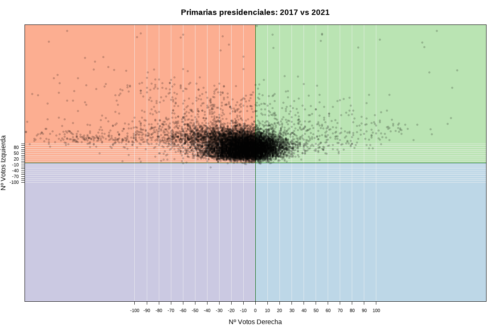
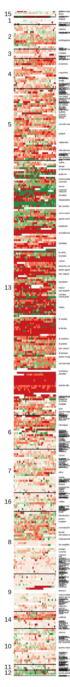

# Año 2017

Contextos diferentes, elecciones diferentes. Entre el 2017 y 2021 sucedieron varias cosas que hicieron cambiar el escenario político y los actores imperantes... aunque no tanto. 

Comparar ambas primaras nos ofrece un *appetizer* de lo que se vienen en las elcciones presidenciales de 2021, en un ambiente más convulcionado y aparentemente polarizado.

## Año 2021

## 2017 vs 2021

En términos generales, podemos apreciar 


```{r, echo=FALSE}

```


### ADN de la elección


:::: {style="display: grid; grid-template-columns: 1fr 1fr; grid-column-gap: 10px;"}

::: {}
<!-- Lado izquierdo -->
```{r, echo=FALSE}

```
:::

::: {}
<!-- Lado derecho -->
El ADN de esta elección comparativa muestra que...
El ADN de esta elección comparativa muestra que...
El ADN de esta elección comparativa muestra que...
El ADN de esta elección comparativa muestra que...

Los intervalos de colores, corresponden a los cuantiles de la magnitud total calculada.

:::

::::


::: {.infobox .caution data-latex="{caution}"}
Este artículo fue redactado el 2021-11-20 y su última modificación fue en `r Sys.Date()`.
:::