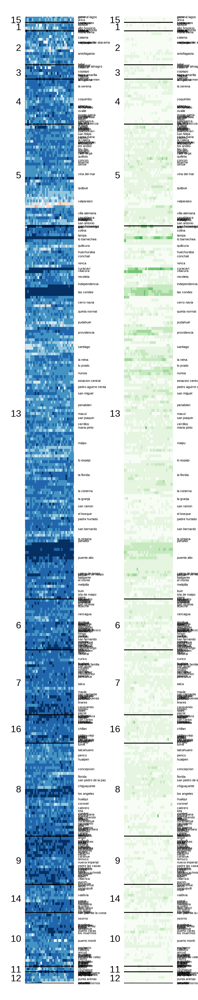

# Año 2017

La primaria electoral del año 2017 fue un evento histórico, ya que por primera vez en el país se organizaban primarias organizadas directamente por el servicio electoral. El día dos de Julio de 2017 se enfrentaron cinco candidatos presidenciales representantes de dos coaliciones: Chile Vamos conformada por la Unión Democrática Independiente (UDI), Renovación Nacional (RN), Evolución Política (EVOPOLI), Partido Regionalista Independiente (PRI); y Frente Amplio, conformada por los partidos Revolución Democrática, Humanista, Liberal, Ecologista Verde, Poder Ciudadano e Igualdad.

El gran ausente de esa ocasión correspondió a la agrupación de partidos gobernante, la Nueva Mayoría que decidió llevar a sus dos candidatos directamente a la primera vuelta electoral.

La primera de Chile Vamos llevó tres candidatos: Sebastían Piñera, Felipe Kast y Manuel José Ossandón. En el caso del Frente Amplio estuvieron los candidatos: Beatriz Sánchez y Alberto Mayol. 


:::: {style="display: grid; grid-template-columns: 1fr 1fr; grid-column-gap: 10px;"}

::: {}
<!-- Lado izquierdo -->
```{r, echo=FALSE}

```
:::

::: {}
<!-- Lado derecho -->
Una manera de retratar los resultados de esta elección es a través de una mirada general los resultados obtenidos. A través del ADN de esta elección tenemos la primaria electoral del año 2017, donde podemos observar dos columnas de información general sobre la participación electoral en este evento. 

Cada uno de estos gráficos corresponde a una escala de color el cuál representa un intervalo de los cuantiles de la magnitud total calculada.

En el lado izquierda podemos la tendencia de la mesa estacionaria donde los colores más cercanos a azul indican una menor participación por parte de la izquierda - Y por lo tanto una proporción mayor de votos emitidos son de derecha - mientras que colores más cercanos al rojo indican mayor participación en las primarias de derecha - y por lo mismo una menor participación en las primarias de izquierda-.

A la derecha podemos observar un gráfico que presenta un similar esquema con la diferencia que la escala de color indica la proporción de votantes, donde los colores verdes más fuertes indican una mayor tasa de participación en contraste con los colores más claros - cercanos a blanco - los cuáles indican menores indices de participación.

:::

::::


::: {.infobox .caution data-latex="{caution}"}
Este artículo fue redactado el 2021-11-20 y su última modificación fue en `r Sys.Date()`.
:::


